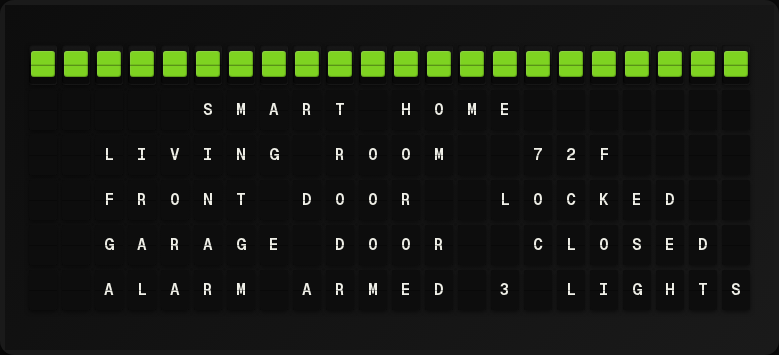

# Home Assistant Plugin



Display entity states from your Home Assistant instance.

**→ [Setup Guide](./docs/SETUP.md)** - Access token setup and configuration

## Overview

The Home Assistant plugin connects to your Home Assistant instance and allows you to display any entity state on your board. It supports dynamic entity access, so you can reference any entity by its ID.

**Two data modes are available:**

| Mode | How it works | Latency | Requires |
|------|-------------|---------|----------|
| **REST polling** (default) | Periodically calls HA REST API | 10–30 s | HA URL + access token |
| **MQTT Statestream** | Subscribes to real-time MQTT state changes | Near-instant | MQTT broker + HA Statestream integration |

## Features

- Connect to any Home Assistant instance
- Display any entity state
- Dynamic entity access in templates
- Support for sensors, binary sensors, switches, and more
- Configurable entity list
- **MQTT Statestream mode** — real-time entity updates with zero polling
- Automatic REST fallback when MQTT is unavailable

## Quick Setup

For detailed setup instructions including access token creation, see the **[Setup Guide](./docs/SETUP.md)**.

### REST Mode (default)

Set `base_url` and `access_token` in the plugin configuration.

### MQTT Statestream Mode

1. Enable the [MQTT Statestream](https://www.home-assistant.io/integrations/mqtt_statestream/) integration in Home Assistant (`configuration.yaml`):
   ```yaml
   mqtt_statestream:
     base_topic: homeassistant/statestream
     publish_attributes: true
     publish_timestamps: false
   ```
2. Set `mqtt_statestream: true` in the plugin configuration.
3. If FiestaBoard's system MQTT broker (`MQTT_BROKER_HOST`) already points at the same broker HA uses, no additional broker settings are needed. Otherwise, set `statestream_broker_host` / `statestream_broker_port`.

## Template Variables

### Status

```
{{home_assistant.connected}}      # "Yes" or connection status
{{home_assistant.entity_count}}   # Number of entities
{{home_assistant.data_source}}    # "rest" or "mqtt_statestream"
```

### Dynamic Entity Access

Access ANY entity using its full entity_id:

```
{{home_assistant.sensor.temperature.state}}
{{home_assistant.binary_sensor.front_door.state}}
{{home_assistant.light.living_room.state}}
{{home_assistant.switch.fan.state}}
{{home_assistant.climate.thermostat.state}}
```

### Configured Entities

If you configure entities with display names:

```
{{home_assistant.entities.Temperature.state}}
{{home_assistant.entities.Front Door.state}}
```

## Example Templates

### Basic Sensors

```
{center}HOME STATUS
Temp: {{home_assistant.sensor.temperature.state}}°
Door: {{home_assistant.binary_sensor.front_door.state}}
Lights: {{home_assistant.light.living_room.state}}
```

### Smart Home Dashboard

```
{center}HOME
Indoor: {{home_assistant.sensor.indoor_temp.state}}°
Outdoor: {{home_assistant.sensor.outdoor_temp.state}}°
Garage: {{home_assistant.cover.garage_door.state}}
Alarm: {{home_assistant.alarm_control_panel.home.state}}
```

### Door/Window Status

```
{center}SECURITY
Front: {{home_assistant.binary_sensor.front_door.state}}
Back: {{home_assistant.binary_sensor.back_door.state}}
Garage: {{home_assistant.binary_sensor.garage.state}}
Windows: {{home_assistant.binary_sensor.windows.state}}
```

## Configuration

| Setting | Type | Required | Description |
|---------|------|----------|-------------|
| enabled | boolean | No | Enable/disable the plugin |
| base_url | string | REST mode | HA URL (e.g., http://192.168.1.100:8123) |
| access_token | string | REST mode | Long-lived access token |
| entities | array | No | Specific entities to monitor |
| timeout | integer | No | Request timeout (default: 5) |
| refresh_seconds | integer | No | Update interval (default: 30) |
| mqtt_statestream | boolean | No | Enable MQTT Statestream mode (default: false) |
| statestream_base_topic | string | No | MQTT topic prefix (default: homeassistant/statestream) |
| statestream_broker_host | string | No | Override MQTT broker host (defaults to MQTT_BROKER_HOST) |
| statestream_broker_port | integer | No | Override MQTT broker port (defaults to MQTT_BROKER_PORT) |

### Entity Configuration

Configure specific entities with friendly names:

```json
{
  "entities": [
    {"entity_id": "sensor.temperature", "name": "Temp"},
    {"entity_id": "binary_sensor.front_door", "name": "Front"}
  ]
}
```

## Entity States

Common entity state values:

| Entity Type | States |
|------------|--------|
| binary_sensor | on, off |
| sensor | numeric or text value |
| light | on, off |
| switch | on, off |
| cover | open, closed, opening, closing |
| lock | locked, unlocked |
| climate | heat, cool, auto, off |

## Color Rules

You can apply colors based on entity states:

- **on** → Green
- **off** → Red
- **open** → Orange
- **closed** → Green
- **unavailable** → Red

## Security Notes

- Access token should be kept secure
- Use HTTPS when possible for external access
- Token has full API access - treat it like a password
- MQTT broker credentials are resolved from env vars; avoid storing them in plugin config when possible

## Troubleshooting

### Connection Failed

1. Verify Home Assistant URL is correct
2. Check network connectivity
3. Ensure port is open (usually 8123)
4. Verify access token is valid

### Entity Not Found

1. Check entity_id spelling exactly
2. Verify entity exists in HA Developer Tools → States
3. Some entities may be hidden by default

### MQTT Statestream Not Receiving Data

1. Verify the **MQTT Statestream** integration is enabled in Home Assistant
2. Check that `statestream_base_topic` matches the `base_topic` in your HA `configuration.yaml`
3. Confirm FiestaBoard can reach the MQTT broker (same broker HA publishes to)
4. Use an MQTT client (e.g. `mosquitto_sub -t 'homeassistant/statestream/#'`) to verify HA is publishing

## Author

FiestaBoard Team

